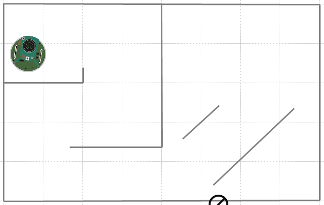
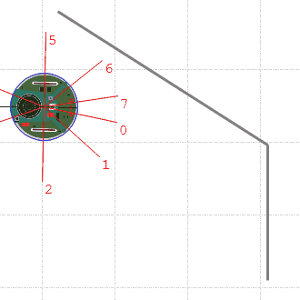
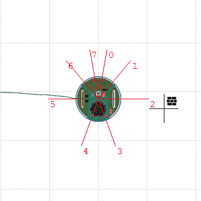
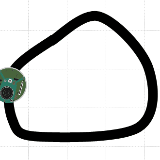

# robotBox - 2D robot simulator
robotBox is a 2D robot simulator for Windows

## Features
* Single robot simulations
* Create walls
* Create paths
* Save and load maps
* Export simulations to video (requires ffmpeg)
* Multiple languages
* Collision detection
* Edit the map in real time while the simulation is running

## Supported robots
* ePuck
	* Proximity sensors
	* Floor sensors
	* Wheel motors
	* Leds
	* Wheel encoders
	

## System requirements
* .NET Framework 4.0 or higher

## Support the author
If you find this project useful, please consider supporting the author

## License
This project is licensed under [GNU GPL v3.0](LICENSE)
